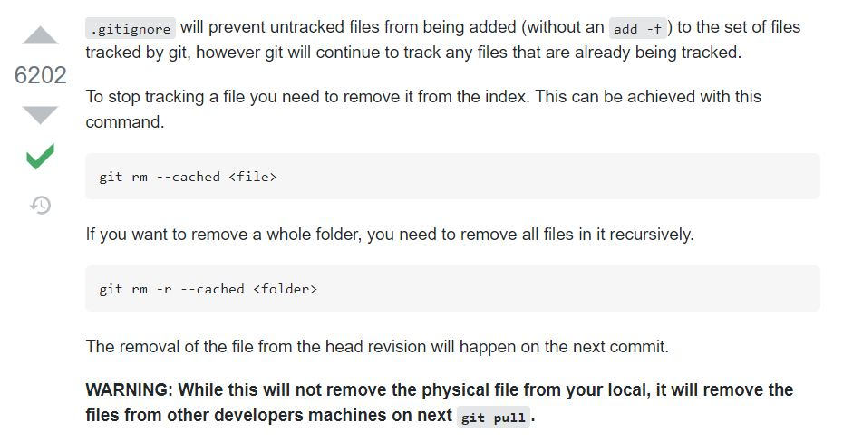

### SANBOX

This is my playground repository where I test and learn data structures and algorithm.

#### Table of Content

1. Tail Call
2. ES6 Set data structure
3. Removing published file or directory from GitHub

### Tail Call

Tail call calls and returns another function inside a parent function. This subroutine optimize memory as the recursion won't grow the stack.

### ES6 Set data structure

Set data structure stores only unique values in a container. This is useful if you want to get only a unique attributes from a collection like an array of objects from an API response. It uses the value as a key. 

### Removing files from remote repositories

---

**List< T >**
  
``List<T>`` is a collection of elements that can be referenced by index [n]. This type can grow and shrink enabling programmers to add or remove elements.
  
  See official docs at https://docs.microsoft.com/en-us/dotnet/api/system.collections.generic.list-1?view=net-5.0
  

### Fibonacci C#

**Using while loop**

Use case scenario: Use while loop if there is already an elements that can be used for counting until the loop is false.

<pre><code>
var sequence = new List<int> { 1, 1 };

while (sequence.Count < 20)
{
    var a = sequence[sequence.Count - 1];
    var b = sequence[sequence.Count - 2];

    sequence.Add(a + b);
}

foreach (var x in sequence)
{
    Console.WriteLine(x);
}
</code></pre>

---

                           
**Using for loop**         
                           
Use case scenario: Use for loop when using empty collection and using a counter in  computation.
             
<pre><code>             
var sequence = new List<int> {};

for (int i = 1; i <= 20; i++)
{
    if (i < 3)
    {
        sequence.Add(1);
    }
    else
    {
      var a = sequence[sequence.Count - 1];
      var b = sequence[sequence.Count - 2];

      sequence.Add(a + b);
    }
}

foreach(var x in sequence)
{
    Console.WriteLine(x);
}
</code></pre>
